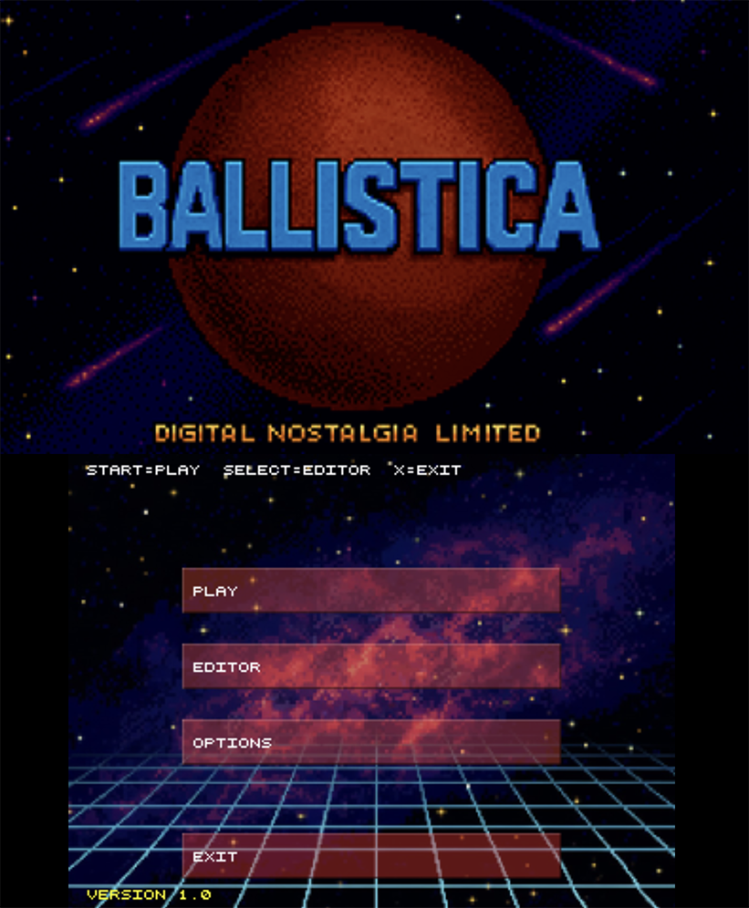
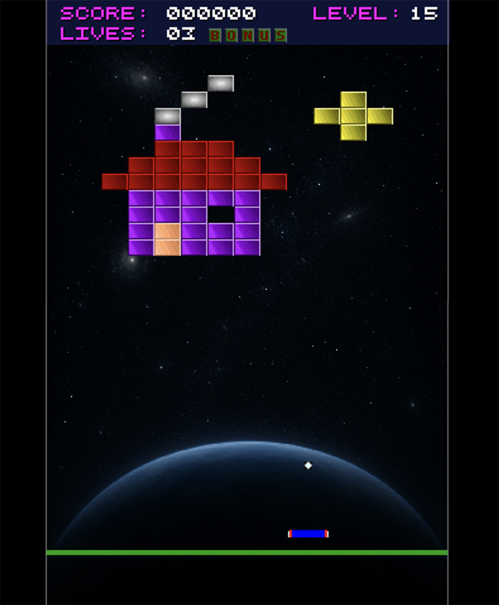
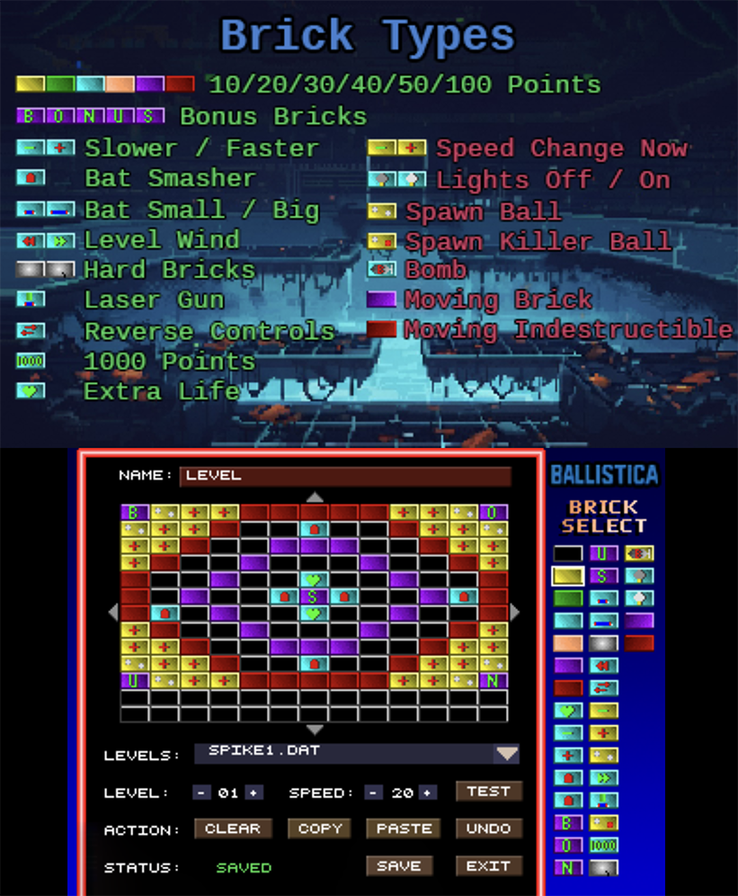
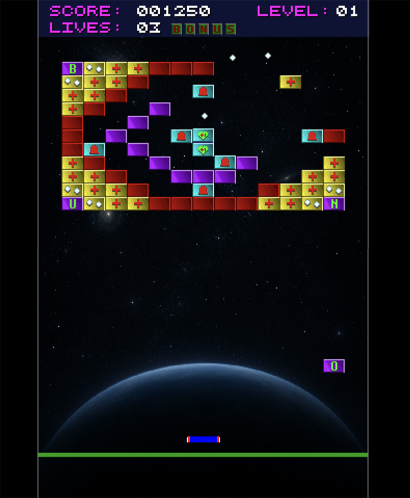

# 3DS Ballistica Game

This repo contains a port of the Ballistica game engine to the Nintendo 3DS platform.

This game was originally developed by [Stephen Eddy](https://x.com/steddyman) for the IBM PC with VGA in 1994.  The 3DS version is a port of the original DOS codebase, with some enhancements and modifications to work on the 3DS hardware.

It makes use of both 3DS screens and the 3DS controls.  It contains a full level editor, so you can create your own levels and play them on the 3DS.

## Screenshots

<table>
	<tr>
		<td align="center">
			
			 Main Menu
		</td>
		<td align="center">
			
			 Gameplay
		</td>
	</tr>
	<tr>
		<td align="center">
			
			 Level Editor
		</td>
		<td align="center">
			
			 More Gameplay
		</td>
	</tr>
  
</table>

# Using the Release Build

You can download the latest release build from the Releases section of this repository.  Look for a file named `ballistica.3dsx`.  Copy this file to the **/3ds/ballistica** folder of your 3DS SD card and run it using the homebrew launcher.

# Controls

The game uses the following controls:
- Stylus - Move the paddle, select menu items, draw in the level editor
- D-Pad Up - Launch ball (when in play mode), Fire Laser (when collected)
- D-Pad Down - Activate Tilt (when indicator is shown)

If the game detects a ball may be stuck, it will flash up the Tilt indicator.  Press D-Pad Down to activate the tilt and free the ball.

# Contributing

The levels are stored in the `levels` folder.  You can create your own levels using the in-game level editor, or by editing the text files directly, then copying the .DAT files from the **/ballistica/levels** folder on your 3DS SD card to your computer.

I encourage you to create your own levels and share them with others, by raising a PR against this repository with a description of your levels.

If this repo is useful to you, please consider starring it to help others find it and tell your friends about the game.
** **